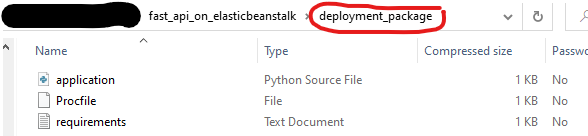
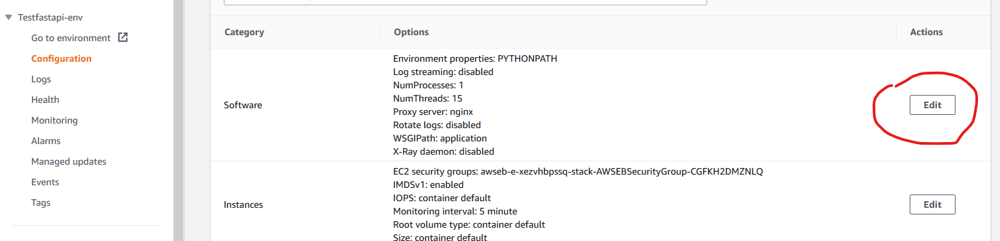
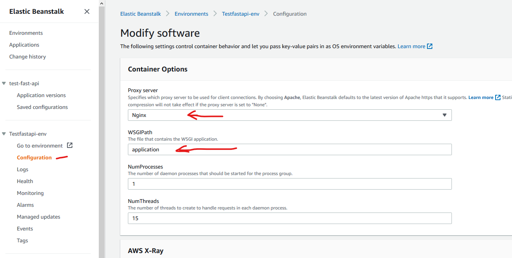
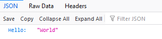
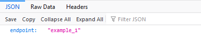

# Fast API running on AWS Elastic Beanstalk

Example of deploying a [Fast API](https://fastapi.tiangolo.com/) instance to AWS Elastic Beanstalk

Note - this is a barebones example so no SSL or Auth is implemented. What you deploy is visible to the entire world

## Components

### application.py

This is the actual file that runs the api server

Here, the main component is the __main__ sequence:

```python
if __name__ == '__main__':
    app.app.run()  # Without this call, the server wont run correctly on AWS
```

### requirements.txt

These are the packages AWS Elastic Beanstalk will install upon launch

```txt
fastapi
uvicorn[standard]  # MUST install the [standard] extensions
websockets         # MUST install this as well, or will error out
```

### Procfile

This configures the server run process, and without it the app will not run correctly

```Procfile
web: uvicorn application:app --host=0.0.0.0 --ws websockets
```

## Deployment

Zip the above files into a zipfile `deployment_package.zip` - contents must be:



(Note - name of the zipfile doesnt matter)

### Steps

* 1. [ ] Upload package to AWS EB environment
* 2. [ ] Configure software section for the WSGIPath to be `application` (of application.py)

### Configuring EB to run

#### 1 - navigate to the Software Config section



#### 2 - Set the WSGIPath



## Verifying Successful Deployment

### Navigate in browser

Go to your AWS EB url: `http://{your-env-name}.{random-characters}.{aws-region}.elasticbeanstalk.com/`



Go to url/example_1 endpoint:



### Call programatically

```python
import requests


url = 'http://{your-env-name}.{random-characters}.{aws-region}.elasticbeanstalk.com/'
r = requests.get(url)

print(r)
print(r.status_code)
print(r.text)
```

```text
# root - /
<Response [200]>
200
{"Hello":"World"}

# /example_1
<Response [200]>
200
{"endpoint":"example_1"}
```
